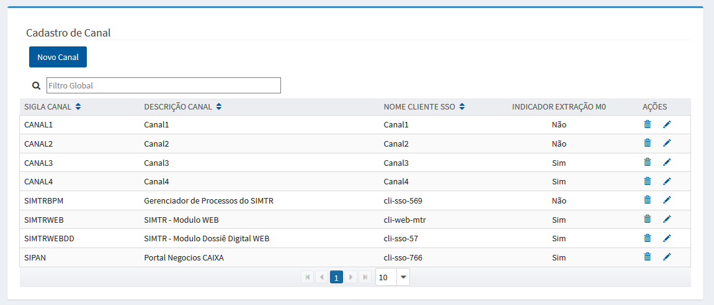
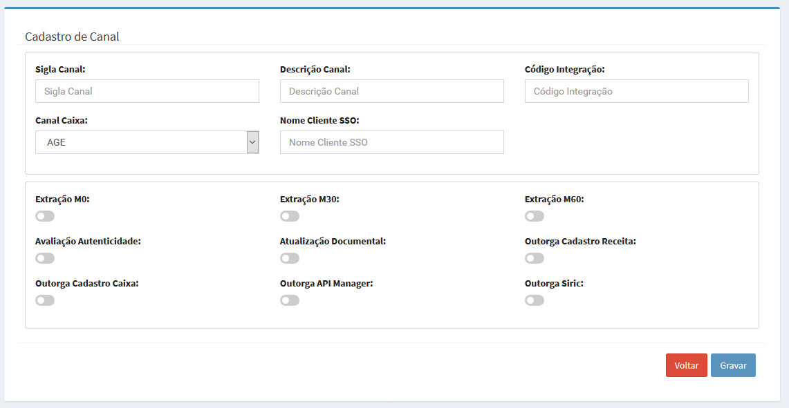

# Cadastro de Canal

# Perfis

>> Funcionalidade acessada pelos seguintes perfis: 
	  
>> + **MTRADM**
 
>> + **MTRSDNTTG**

>> + **MTRSDNTTO**

**OBS: Solicitação de acesso via https://novoacessologico.caixa, selecionando o sistema SIMTR e, em seguida, os perfis desejados. **

O cadastro de canal corresponde o cadastro dos tipos de terminais de captura de um documento para identificação de sua origem.

Após acionar a opção correspondente no menu

 >>>> 

 
 o sistema apresenta a tela com a relação dos canais cadastrados:
 
>>>> 
  
  
>> +  - apresenta o formulário para inclusão de canal:

>>>>

>> +  - apresenta o formulário do canal desejado para alteração;

>> +  - realiza a remoção do canal, após a confirmação da intenção em realizar a exclusão do registro.

