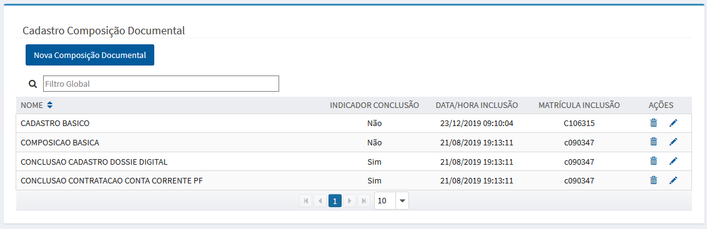
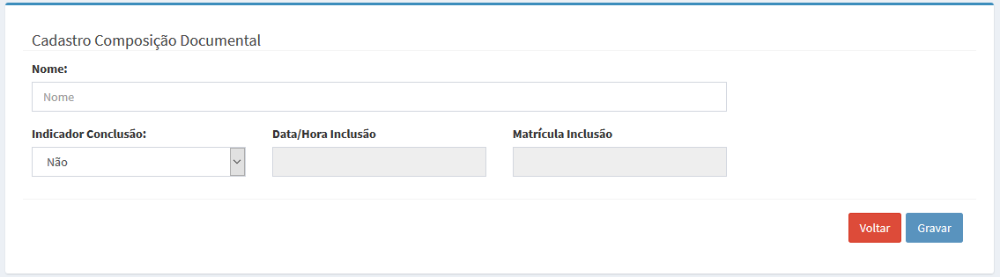

# Cadastro de Composições Documentais

# Perfis

>> Funcionalidade acessada pelos seguintes perfis: 
	  
>> + **MTRADM**
 
>> + **MTRSDNTTG**

>> + **MTRSDNTTO**

**OBS: Solicitação de acesso via https://novoacessologico.caixa, selecionando o sistema SIMTR e, em seguida, os perfis desejados. **

O cadastro da composição documental que corresponde a definição do nome negocial da composição de documentos.

Após acionar a opção correspondente no menu

 >>>> 

 
 o sistema apresenta a tela com a relação das composições documentais cadastradas:
 
>>>> 
  
  
>> +  - apresenta o formulário para inclusão da composição documental:

>>>>

>> +  - apresenta o formulário para alteração dos dados da composição documental desejada;

>> +  - realiza a remoção da composição documental, após a confirmação da intenção em realizar a exclusão do registro.