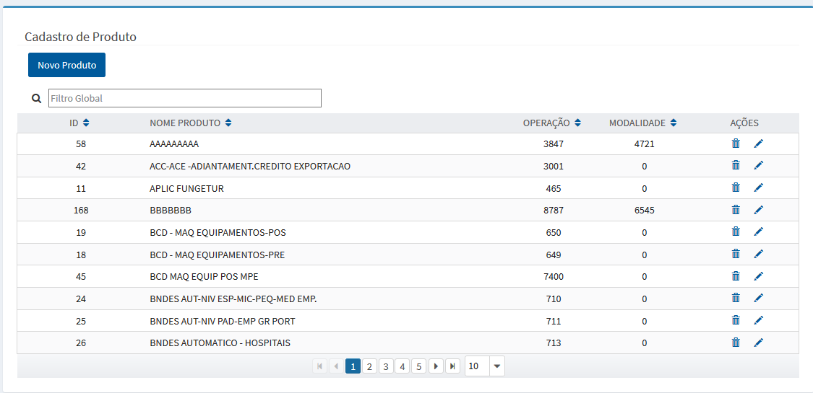

# Cadastro de Produtos

# Perfis

>> Funcionalidade acessada pelos seguintes perfis: 
	  
>> + **MTRADM**
 
>> + **MTRSDNTTG**

>> + **MTRSDNTTO**

**OBS: Solicitação de acesso via https://novoacessologico.caixa, selecionando o sistema SIMTR e, em seguida, os perfis desejados. **

O cadastro de produtos

Após acionar a opção correspondente no menu

 >>>> 

 
 o sistema apresenta a tela com a relação dos produtos cadastrados:
 
>>>> 
  
  
>> +  - apresenta o formulário para inclusão do produto:

>>>>

>> +  - apresenta o formulário para alteração dos dados do produto desejado;

>> +  - realiza a remoção do produto, após a confirmação da intenção em realizar a exclusão do registro.