# Complementação

# Perfis

>> Funcionalidade acessada pelos seguintes perfis: 
	  
>> + **MTRADM**
 
>> + **MTRSDNTTG**

>> + **MTRSDNTTO**

**OBS: Solicitação de acesso via https://novoacessologico.caixa, selecionando o sistema SIMTR e, em seguida, os perfis desejados. **

Ao acionar a opção referente no menu da lateral é apresentada a tela:

 >>>>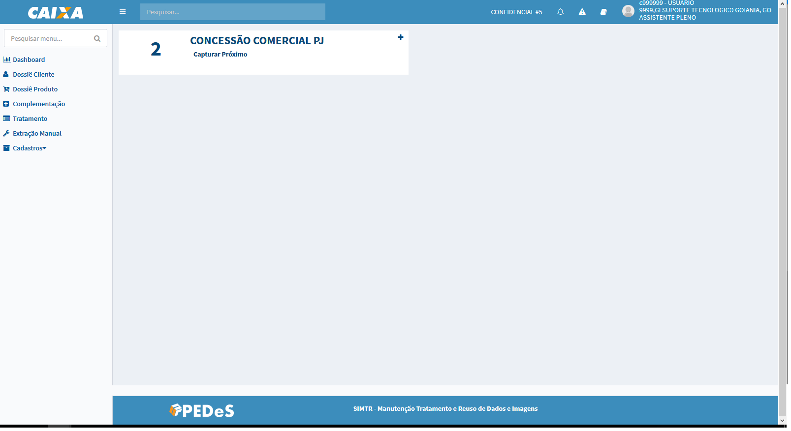 
 
 >>>>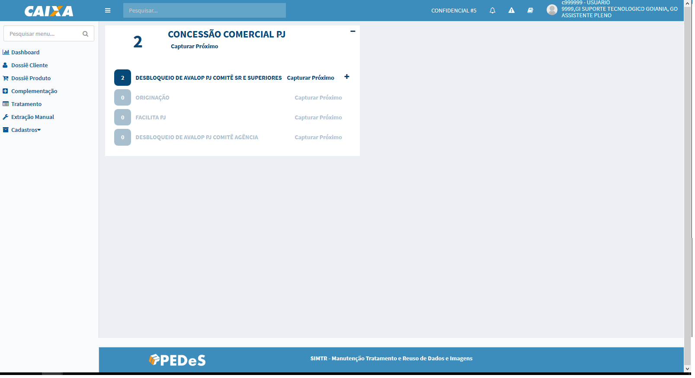 

 O sistema apresenta a tela com os Dossiês Produto, que estão na situação **Aguardando Complementação**, agrupados pelo processo em ordem alfabética, cuja unidade responsável por realizar a complementação seja a unidade de lotação do usuário autenticado.
 

 Para cada processo é apresentado o **Total** de dossiês produtos aguardando complementação. Abaixo segue descrições das opções apresentadas:
 
>> +  - essa opção expande a visualização dos dossiês a nível de processos gerador de dossiê;
 
>> +  - essa opção recolhe a expansão do nível de processos para visualização padrão;
 
 
 >>>>

  
>> + **Tratar Próximo** - opção apresentada tanto na visão processo como dos processos geradpr de dossiê que quando acionada apresenta a tela de manutenção dossiê produto para complementação da informação:
  
>>>>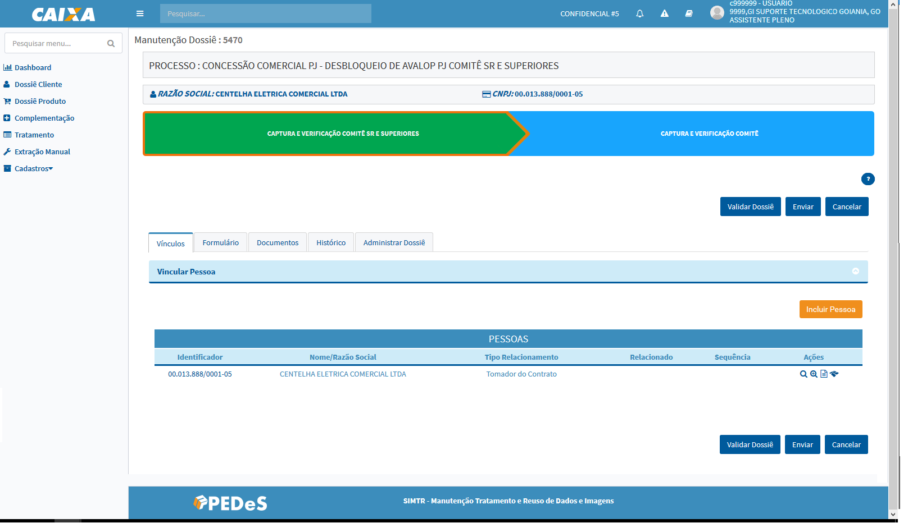
	
O sistema habilita as opções para manipulação das abas de Vínculos, Formulário, Documentos e Administração para complementação da informação necessária:

 >>>>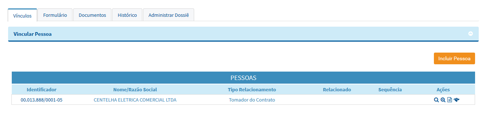
 
 >>>>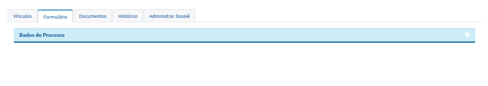

 >>>>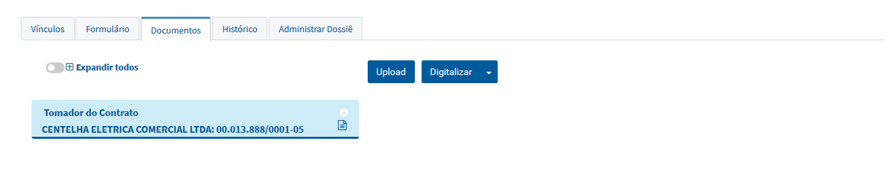
 
 >>>>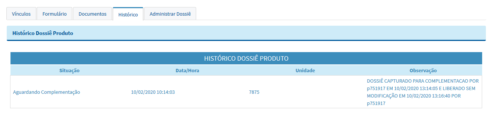
 
 >>>>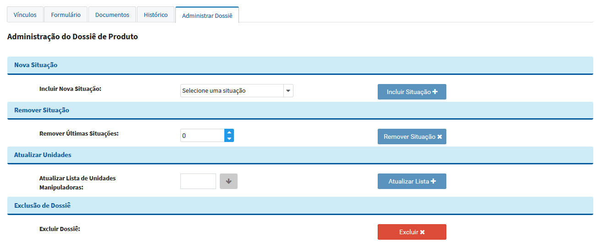

 
 >> + 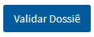 - apresenta as validações obrigatórias para o envio do dossiê para tratamento que ainda estão pendentes de complementação;
 
 >> + 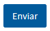 - altera a situação do dossiê para "Alimentação Finalizada" e retorna para tela de captura de dossiê para complementação;
 
 >> + 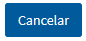 - apresenta uma mensagem para confirmar que as alterações serão descartadas, confirmando a intenção o sistema altera a situação do dossiê de "Em complementação" para "Aguardando Complementação" e retorna para tela de captura de dossiê para complementação com a lista atualizada.