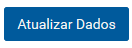
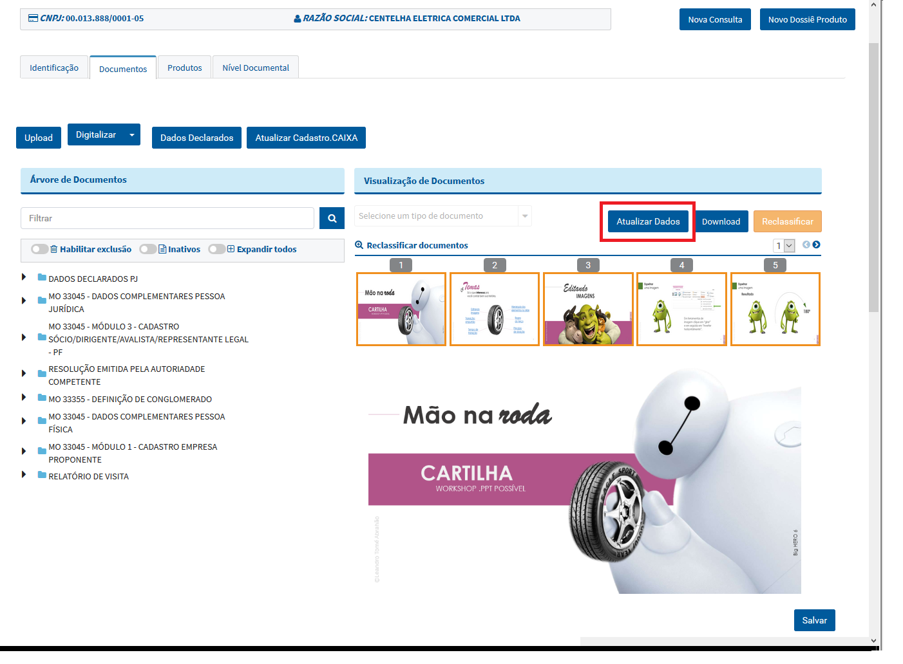
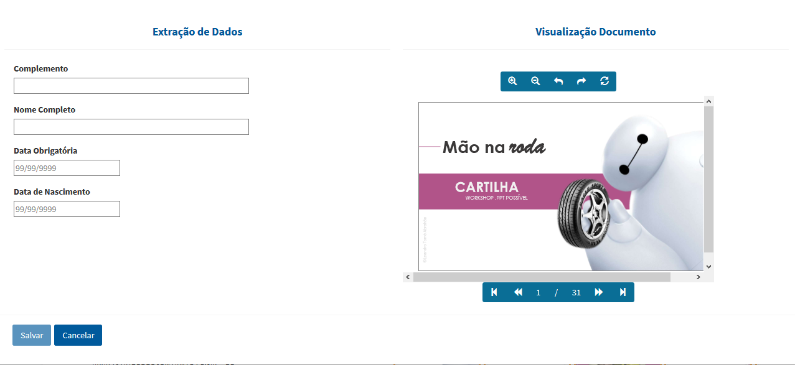
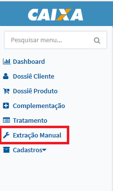
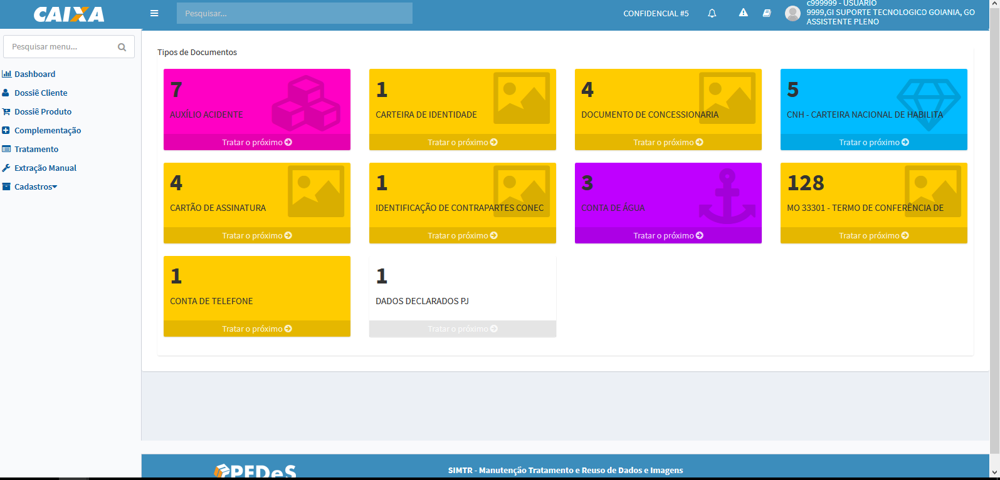
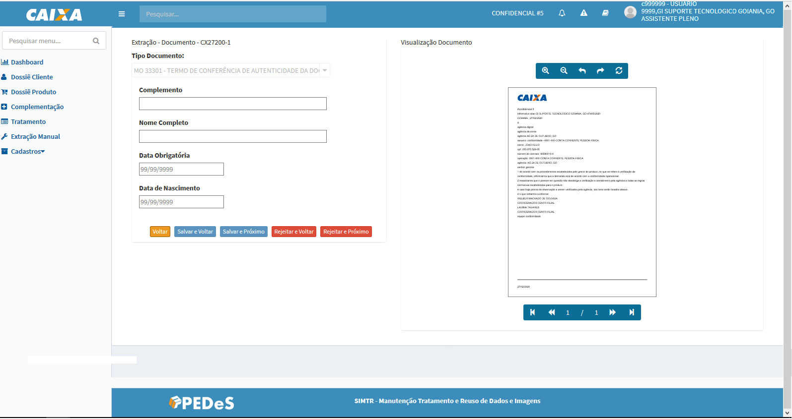
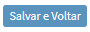
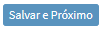

# Extração Manual

# Perfis

>> Funcionalidade acessada pelos seguintes perfis: 
	  
>> + **MTRADM**
 
>> + **MTRSDNTTG**

>> + **MTRSDNTTO**

**OBS: Solicitação de acesso via https://novoacessologico.caixa, selecionando o sistema SIMTR e, em seguida, os perfis desejados. **

A extração manual tem dois momentos, primeiro momento trata a inclusão do tipo documento pelas funcionalidade do Dossiê Cliente ou Dossiê Produto, e outro momento a extração dos dados de fato que pode ser realizada pela funcionalidade **Extração Manual** ou pela funcionalidade **Dossiê Cliente**.

##Submissão documento
 
>> Pré-condição

>>> + Definir atributos de extração para o tipo documento desejado;

>>> + Realizar a classificação do tipo documento com sucesso.

>>>> A extração pode ser acionada após classificação ou na consulta do tipo documento em questão pelo botão  o sistema apresenta o formulário:

>>>> 

>>>> 

>> O sistema apresenta os atributos definidos para extração manual dos dados do documento.

## Consulta documento

>> Pela funcionalidade referente no menu da lateral é apresentada a tela:

>>>> 

>> O sistema apresenta a tela com os tipos documentos, que estão pendentes de extração, agrupados pelo tipo documento em ordem alfabética.

>> Para cada tipo documento é apresentado o **Total** de documentos aguardando tratativa de extração. Abaixo segue descrições das opções apresentadas:
 
>>>> 
 
>> + **Tratar Próximo** - opção quando acionada apresenta a tela para extração dos dados manual do tipo documento:
 
>>>> 

>> O sistema apresenta os atributos definidos para extração manual dos dados do documento.

>>>> 

>> +  - retorna para lista de documentos aguardando realização da extração manual;
  
>> +  - salva as informações inseridas manualmente e retorna para lista de documentos aguardando realização da extração manual;
	
>> +  - salva as informações inseridas manualmente e apresenta o próximo documento aguardando a realização da extração manual para o tipo em questão; 
	  
>> +  - rejeita as informações inseridas manualmente, retorna o tipo documento para a lista e retorna para lista de documentos aguardando realização da extração manual;
  
>> +  - rejeita as informações inseridas manualmente e apresenta o próximo documento aguardando a realização da extração manual para o tipo em questão. 