# Tratamento Dossiê Produto

# Perfis

>> Funcionalidade acessada pelos seguintes perfis: 
	  
>> + **MTRADM**
 
>> + **MTRSDNTTG**

>> + **MTRSDNTTO**

**OBS: Solicitação de acesso via https://novoacessologico.caixa, selecionando o sistema SIMTR e, em seguida, os perfis desejados. **

Ao acionar a opção referente no menu da lateral é apresentada a tela:

 >>>>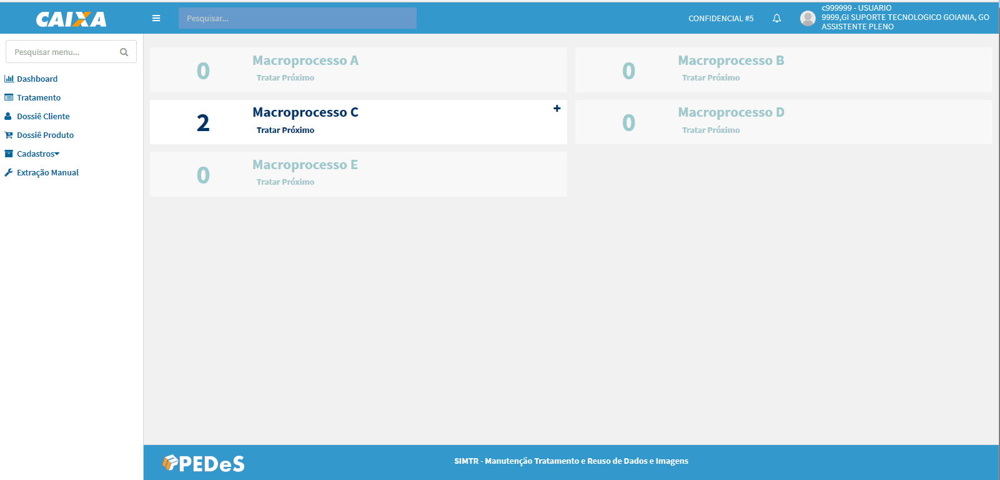 

O sistema apresenta a tela com os Dossiês Produto, que estão na situação **Aguardando Tratamento**, agrupados pelo processo em ordem alfabética, cuja unidade responsável por realizar o tratamento seja a unidade de lotação do usuário autenticado.
 
>>>> OBS: os processos que não apresentarem dossiês produto para tratamento são apresentados desabilitado. 

Para cada processo é apresentado o **Total** de dossiês produtos aguardando tratamento. Abaixo segue descrições das opções apresentadas:
 
>> + 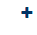 - essa opção expande a visualização dos dossiês a nível de processos gerador de dossiê;
 
>> + 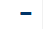 - essa opção recolhe a expansão do nível de processos gerador de dossiê para visualização padrão;
 
>>>>
  
>> + **Tratar Próximo** - opção apresentada tanto na visão processo como dos processos gerador de dossiê que quando acionada apresenta a tela de tratamento:
  
>>>>
	
>>>> + **Código dossiê produto** - informação apresentada no canto superior esquerdo da tela que representa o código de identificaçãodo do dossiê produto que está em tratamento. Apartir desse código é possível realizar consultas do dossiê produto no sistema.

>>>> + **Etapas do dossiê produto** - apresenta as etapas definidas para o processo, segue a legenda:

>>>>>> + Verde - representa a etapa atual do dossiê produto, objeto de tratamento;  

>>>>>> + Azul - representa a(s) próxima(s) etapa(s) do dossiê produto, não é(são) objeto(s) de tratamento, essa(s) etapa(s) o sistema permite apenas a navegação dessa(s) etapa(s) com intuito de informação, nenhuma alteração é permitida.

>>>>>> + Azul - representa a(s) etapa(s) anterior(es) do dossiê produto, que já foi(ram) objeto(s) de tratamento, o sistema permite a navegação da(s) etapa(s) com intuito de informação, nenhuma alteração é permitida.

>>>>>> - essa opção permite recolher as informações do dossiê cliente as demais informações da lateral para aumentar o campo de tratamento dos documentos: 

>>>>>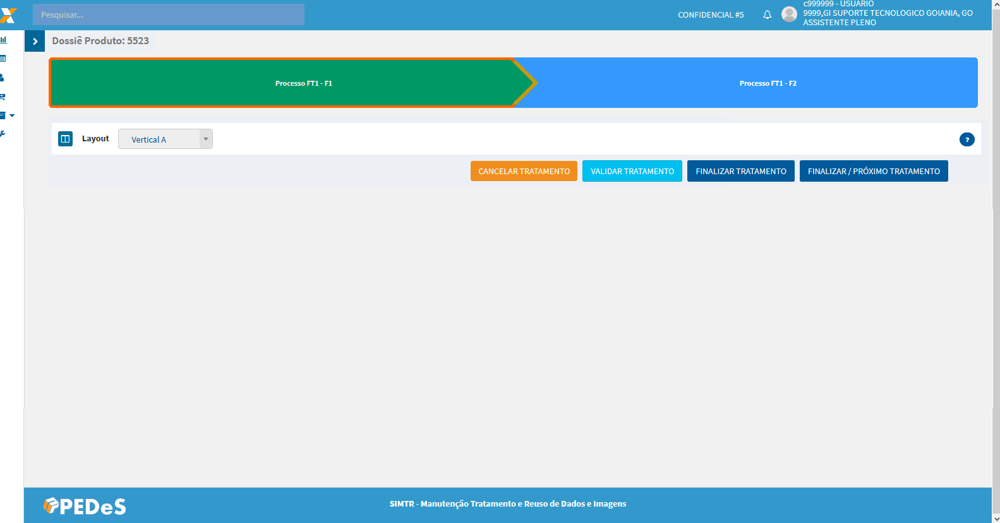
 
>>>> + **Informações do Dossiê Cliente** - apresenta os dados do dossiê cliente responsável pelo dossiê produto 
 
>>>> + **Selecione uma opção: ** 
 
>>>>>> + **Checklist ** - a tela de tratamento é carregada com essa opção selecionada, com apresentação do(s) checklist(s) prévio, da fase e dos vínculos (pessoas, produtos e garantias) para tratamento dos documentos submetidos conforme definição do processo;
 
>>>>>> + **Formulário ** - apresenta as perguntas e respostas preenchidas para o processo na manutenção do dossiê produto.;
  
>>>>>> + **Garantias ** - apresenta o(s) vínculo(s) de garantia(s) definida(s) para o processo na manutenção do dossiê produto;
   
>>>>>> + **Pessoas ** - apresenta o(s) vínculo(s) de pessoa(s) definida(s) para o processo na manutenção do dossiê produto;
	
>>>>>> + **Produtos ** - apresenta o(s) vínculo(s) de produto(s) definido(s) para o processo na manutenção dossiê produto.
 
 
 
# Verificação do Checklist
 
O formulário é carregado com os checklist prévios para tratamento.
 
>> Checklist prévios - são checklist's cuja verificação Conforme dos apontamentos são obrigatórios para dar continuidade à verificação dos demais documentos do dossiê produto.
 
>>>>>Nem todo processo tem essa definição (parametrização) de checklist prévio.
 
 Após a verificação do(s) checklist(s) com todos os apontamentos Conforme, o sistema apresenta os demais checklist's para verificação.
 
>> Qualquer apontamento Inconforme o sistema não apresenta os checklist para verificação.
 
>>>>> - esse botão realiza o cancelamento do tratamento do dossiê produto onde é desfeita toda a movimentação realizada no tratamento e retorna o dossiê produto para fila de tratamento.
  
>>>>> - esse botão realiza a ação de validar se todas as verificações obrigatórias definidas para o processo foram tratadas.

  >>>>>> O sistema apresenta uma modal com a lista das verificações obrigatórias pendentes para concluir o tratamento e destaca o(s) vínculo(s) (árvore documental) correspondente.
  
 >>>>>
 
 
 >>>>> - esse botão registra a Conformidade ou Inconformidade do tratamento do dossiê produto, registra a situação do dossiê produto e retorna para tela de tratamento.
 
 >>>>> - esse botão registra Conformidade ou Inconformidade do tratamento do dossiê produto, registra a situação do dossiê produto e apresenta o próximo dossiê para tratamento considerando o processo e fase.
 
 >>>>>>> Caso não apresenta dossiê para tratamento no mesmo processo o sistema apresenta uma mensagem alerta para usuário e retorna para tela de tratamento. 
 
 
 
 
# Layout
 
>>>> +  - essa opção permite alterar o layout de apresentação da imagem e checklist na verificação, o sistema já carrega o formulário com a opção Vertical A selecionada.
  
>>>>> +  Vertical A - apresentação na orientação vertical, onde o documento é apresentado na esquerda e o checklist na direita. Opção pré-definida pelo sistema.
   
  >>>>>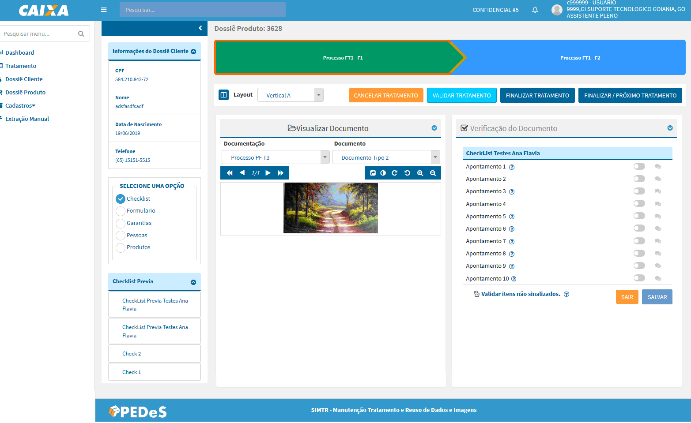
 
>>>>> +  Vertical B - altera apresentação da disponibilização na orientação vertical do documento e checklist, onde o checklist é apresentado na esquerda e o documento na direita.
	
  >>>>>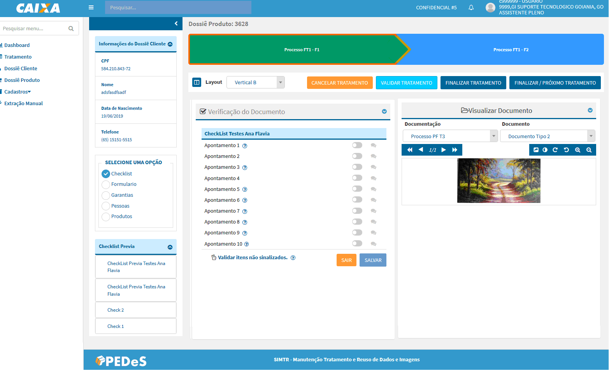
  
>>>> +  Horizontal A - altera apresentação da disponibilização da orientação para horizontal do documento e checklist, onde o documento é apresentado em cima e o checklist embaixo:

  >>>>>
  
>>>> +  Horizontal B - altera apresentação da disponibilização da orientação horizontal do documento e checklist, onde o documento é apresentado em cima e o checklist embaixo.

  >>>>>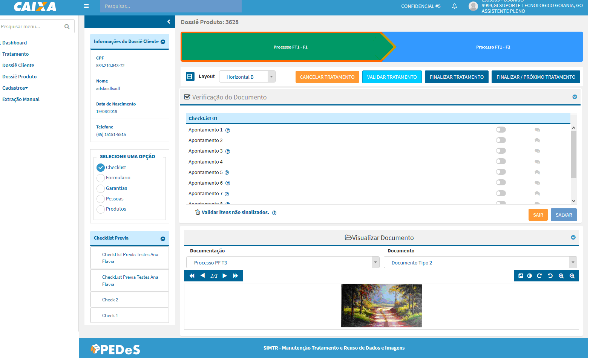
  
  
  
# Configurações do documento

  >>>>>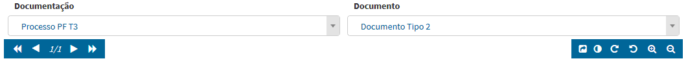
  
  >>>> +  - permite a navegação entre as páginas do documento em tratamento.
  
  >>>> +   - carrega o documento em outra aba do navegador e expande o campo de visualização do checklist, possibilitando uma melhor experiência no tratamento. Ao fechar a aba o sistema retorna para apresentação original: documento x checklist.
  
>>>>> - permite realizar configuração de Brilho e Contraste da imagem para o tratamento, essas configurações não serão salvas, são configurações para melhorar a visualização da imagem durante a verificação. A opção Reset retorna para apresentação original da imagem antes de realizar as configurações.
	
>>>>>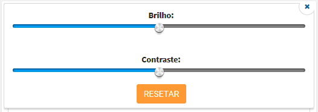
	
>>>> + 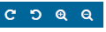 - opções para controle de rotação e controle de zoom do documento em tratamento.
  
   >>>>>>> Todas essas opções de configuração do documento também são apresentadas na aba criada para visualização do documento quando clicado na opção . 

  
# Checklist

  >>>> +  - situação inicial da verificação do apontamento;
  
  >>>> +  - um clique altera a situação do apontamento para Inconforme;
  
  >>>> +  - dois cliques altera a situação do apontamento para Conforme;

   >>>>>>> O sistema habilita a opção  para inclusão de uma orientação relevant do apontamento que será apresentado para área que irá tratar a inconformidade do apontamento. A inclusão de uma orientação não é obrigatória.  
  
   >>>> + 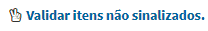 - essa opção permite alterar a situação de todos os apontamentos que estejam na situação inicial para Conforme;
   
   >>>> + 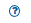 - esse ícone repesenta indicativo de alguma orientação a ser apresentada no formulário e/ou apontamento, para visualizar a orientação basta clicar sobre o ícone.