# Dossiê Produto

# Perfis

>> Funcionalidade acessada pelos seguintes perfis: 
	  
>> + **MTRADM**
 
>> + **MTRSDNTTG**

>> + **MTRSDNTTO**

**OBS: Solicitação de acesso via https://novoacessologico.caixa, selecionando o sistema SIMTR e, em seguida, os perfis desejados. **

A Manutenção do Dossiê Produto pode ser acionada pelo dois caminhos: Dossiê Cliente ou pela opção no Menu: Dossiê Produto:

 >>>>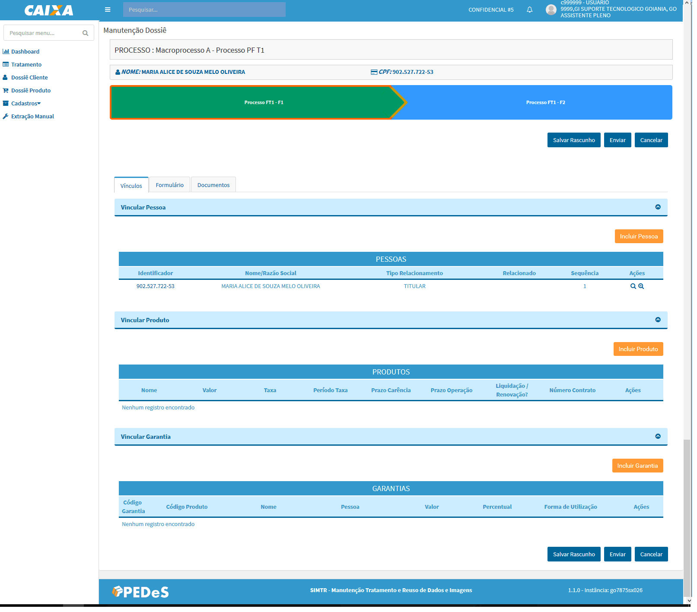 

 >>>>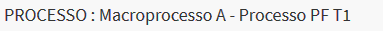 - apresenta a descrição do(s) processo(s) selecionado(s) no dossiê cliente;
 
 
  >>>>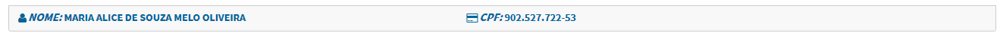 - Nome ou Razão Social / CPF ou CNPJ do dossiê cliente responsável pelo dossiê produto, quando a origem do cadastro do dossiê produto é pelo menu na lateral essa informação não é apresentada até que seja inserido o vínculo de pessoa correspondente.
  
   >>>>  - apresenta as etapas configuradas para o processo:
   
   >>>>>> + Etapa na cor verde - representa a etapa atual do dossiê produto, objeto da manutenção;
   
   >>>>>> + Etapa na cor azul - representa a(s) próxima(s) etapa(s) do dossiê produto que será(ao) objeto(s) de manutenção, não permite manipular as informações apenas consulta;
   
   >>>>>> + Etapa na cor azul esmaecido - representa a(s) etapa(s) anterior(es) do dossiê produto que já foi(ram) objeto de manutenção, não permite manipular as informações apenas consulta;
   
A borda laranja na etapa significa qual etapa cujas informações estão sendo apresentadas no formulário.
   
   >>>> - primeira situação do dossiê produto, nem todo dossiê produto tem registro de histórico nessa fase, estes podem ser enviado direto para tratamento. Essa opção permite salvar o dossiê produto na situação "**Rascunho**", onde nessa situação é possível manipular quantas vezes necessárias as informações 
   
   >>>>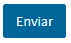 - essa opção quando acionada realiza as validações de obrigatoriedade para enviar um dossiê produto para unidade de tratamento e altera a situação do dossiê para "**Aguardando Tratamento**" e registra o histórico da movimentação nessa situação não é possível alterar mais nenhuma informação do dossiê produto.
   
   >>>>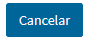 - essa opção permite cancelar a criação ou alteração do dossiê produto, descartando todas as informações preenchidas e retornando para formulário do dossiê cliente que originou o direcionamento do formulário ou para tela inicial do sistema caso a origem seja pela consulta no menu da lateral.
   
   Ao acionar a opção o sistema valida se existe alguma informação preenchida que não foi submetida (salva) e apresenta uma mensagem alerta para usuário informado que os dados serão descartados e se deseja continuar com a operação:
   
 >> + Positivo - o sistema descarta as informações e retorna para o formulário que originou o direcionamento;
 
 >> + Negativo - o sistema não realiza o cancelamento, mantém os dados da tela e aguarda a próxima movimentação do usuário.
   
   >>>>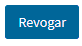 - essa opção permite realizar o cancelamento do dossiê produto salvo. Ao acionar a opção o sistema apresenta uma mensagem para confirmar a intenção de revogar o dossiê produto, após confirmação o sistema registra o histórico de cancelamento do dossiê produto.
   
   >>>>>>> O dossiê produto não permite mais nenhum tipo de manipulação de dados.
   
   >>>>>>> Apenas usuário da mesma unidade originadora do dossiê produto pode realizar a revogação do mesmo.
   
# Vínculos

Nessa aba é realizada inclusão dos vínculos de pessoas(s),produto(s) e garantia(s) no dossiê produto.

## Vincular Pessoa

Quando a inclusão do dossiê produto é originada pelo dossiê cliente o sistema apresenta cliente vinculado ao dossiê como o Titular ou Tomador (conforme parametrização) do dossiê produto:

>>>>

>>>>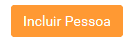 - quando acionado apresenta a modal para inclusão do vínculo.

>>>>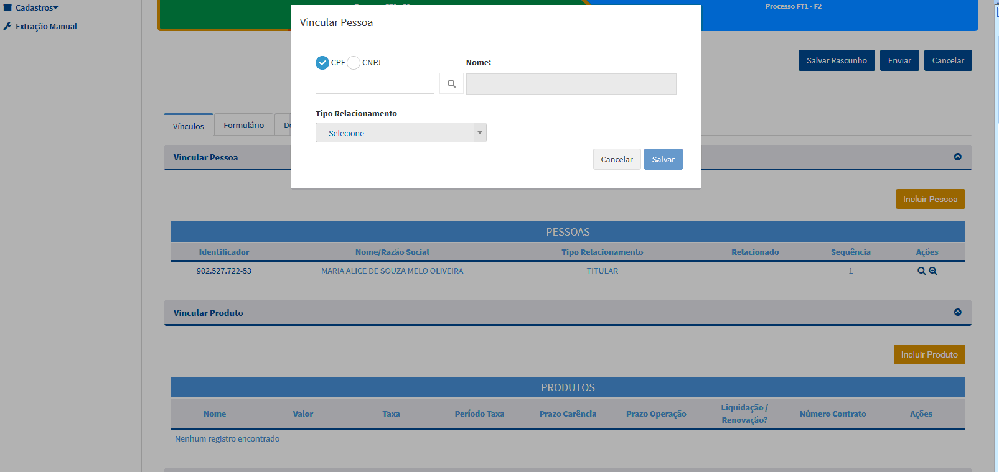

>>>>> + CPF/CNPJ - preenchimento da identificação do vínculo;

>>>>> + Nome - carrega o nome ou razão social do CPF/CNPJ informado, CPF o sistema realiza consulta no banco da RECEITA FEDERAL, CNPJ o sistema realizada consulta no SIISO;

>>>>> + Tipo Relacionamento - carregado com os tipos conforme parametrização para o processo/fase para seleção.

A opção **Salvar** é habilitada após preenchidas as informações: **CPF, Nome e o Tipo de Relacionamento**.

>>>>>>A modal de vincular pessoas também possibilita incluir um novo cliente, basta informar um novo CPF ou CNPJ que o sistema realiza o mesmo comportamento do formulário do dossiê cliente.

Após salvar as informações o sistema atualiza a lista de vínculo de pessoas. 

>>>>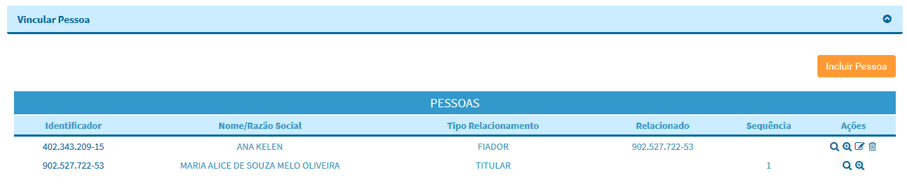

>>>>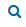 **Pesquisar no SIMTR** - apresenta as informações do dossiê cliente salvas no sistema, conforme apresentado na imagem abaixo:

>>>>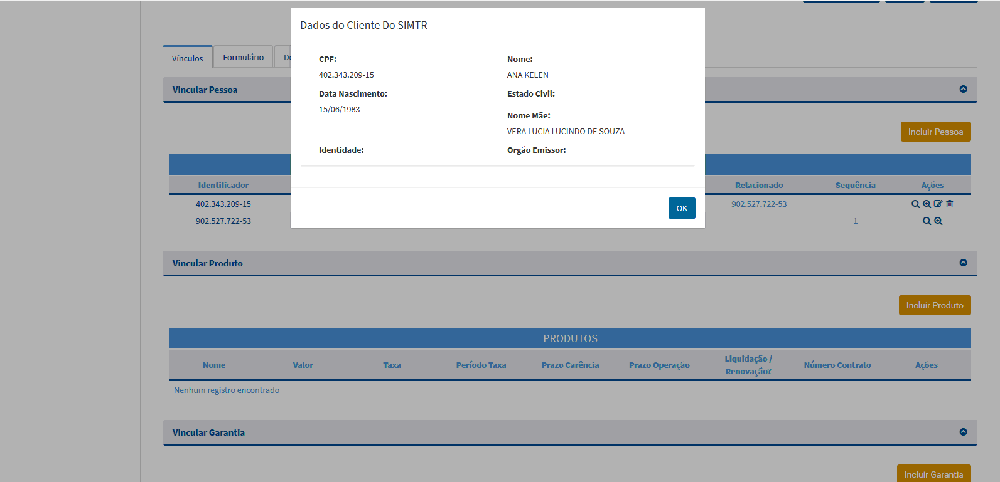
 
>>>> **Pesquisar no SICLI** - apresenta as informações do cliente no SICLI, conforme apresentado na imagem abaixo:
  
>>>>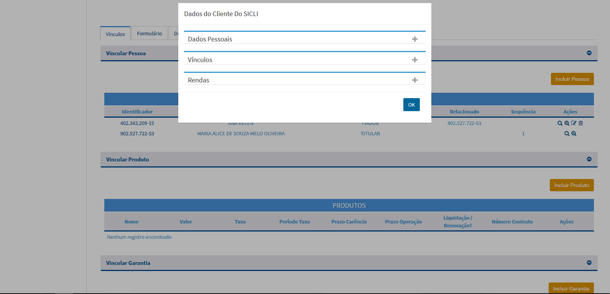
 
 
>>>>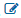 **Editar vínculo pessoa** - apresenta a modal de vínculo alteração. Essa opção não é apresentada para o vínculo responsável (dono) pelo dossiê produto, a seguinte tela é apresentada:
   
>>>>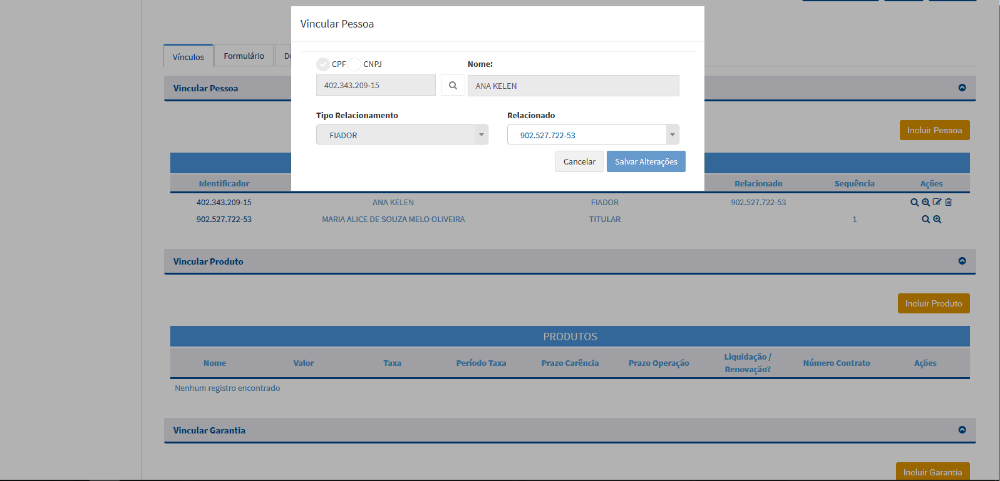

>>>>Apenas o campo “Relacionado” é passível de alteração.

>>>>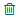 **Excluir vínculo pessoa** – opção que realiza exclusão do vínculo no dossiê produto, ao acionar a opção o sistema apresenta uma mensagem de confirmação para exclusão. Essa opção não é apresentada para o vínculo responsável (dono) pelo dossiê produto.

>>>>>>Para os tipos de relacionamento TITULAR o sistema apresenta o campo para informar a seqüência da titularidade.
 
>>>>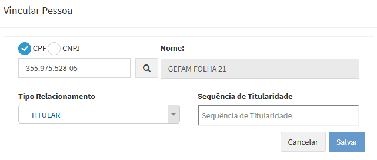

## Vincular Produto

Realiza o vínculo de produto no dossiê produto.

>>>>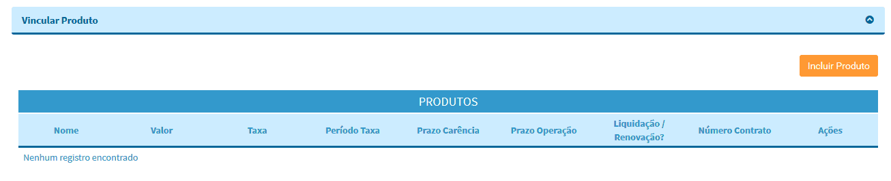

 >>> - quando acionado apresenta a modal para inclusão do vínculo.
 
 >>>>
 
>>>> A opção **Salvar** é habilitada após preenchimento dos campos obrigatórios.

>>>> O sistema atualiza a lista de vínculo de produtos. 

 >>>>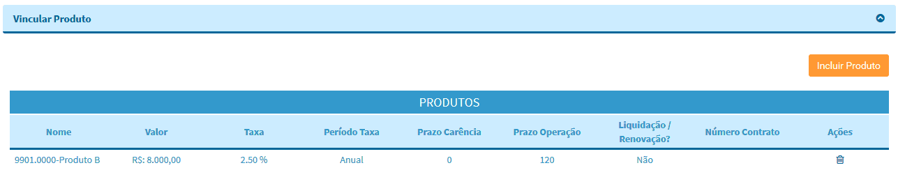

>>>> **Excluir vínculo produto** – opção que realiza exclusão do vínculo de produto no dossiê produto, ao acionar a opção o sistema apresenta uma mensagem de confirmação para exclusão. 

## Vincular Garantia

Realiza o vínculo de garantias no dossiê produto.

>>>>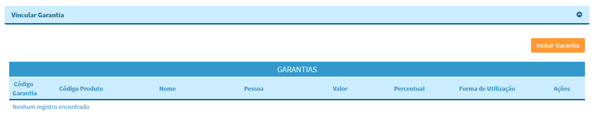

>>>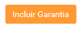 - quando acionado apresenta a modal para inclusão do vínculo.

>>>>

>>>> A opção **Salvar** é habilitada após preenchimento dos campos obrigatórios.

>>>> O sistema atualiza a lista de vínculo de garantias. 

>>>>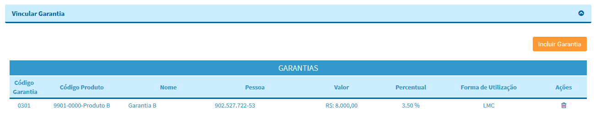

 
# Formulários 

 Apresentação da aba Formulário é dinâmica, os campos são apresentados conforme a parametrização realizada para o processo/fase.
 
>>>>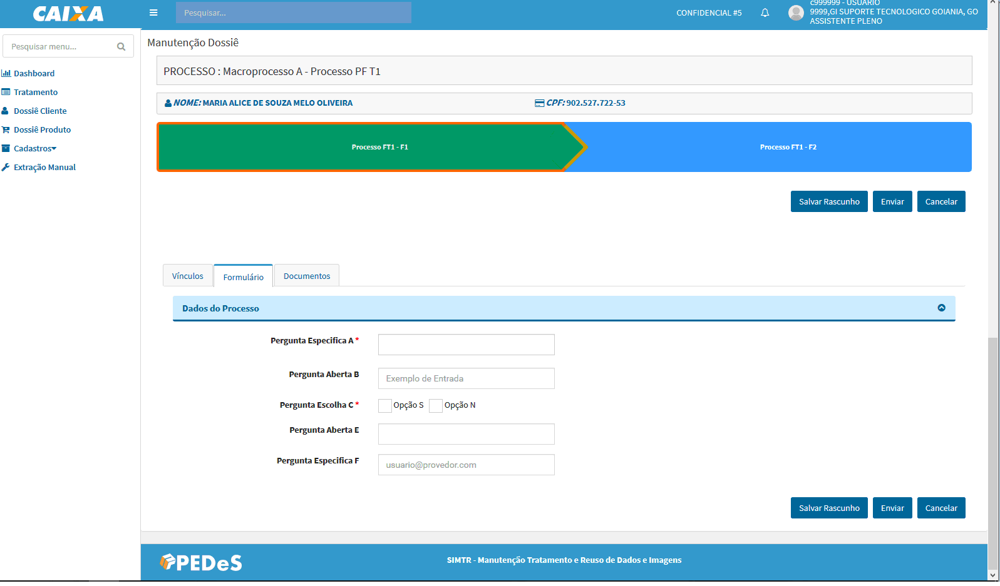

 
 
# Documentos

Apresentação da aba Documentos e montada conforme a inclusão dos vínculos de pessoas, produto(s) e garantia(s) no dossiê produto. Para cada vínculo inserido é apresentada uma árvore documental com os tipos documentos definidos para o vínculo, processo e fase.

>>>>

>>> - expande apresentação dos tipos documentos vinculados as árvores documentais.

>>>>

>>>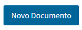 - permite realizar upload de uma imagem da máquina para classificação. Quando acionado o sistema apresenta a tela padrão do Windows para esse tipo de ação:

>>>>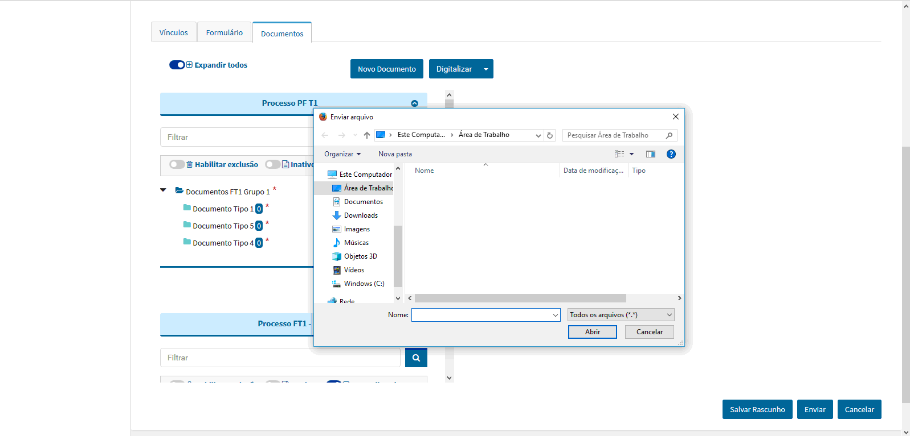

>>>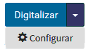 - apresenta o formulário para configuração da digitalização do SCANNER local, as configurações preenchidas são salvas no Local Storage. Ao acionar a opção a seguinte tela é apresentada:

>>>>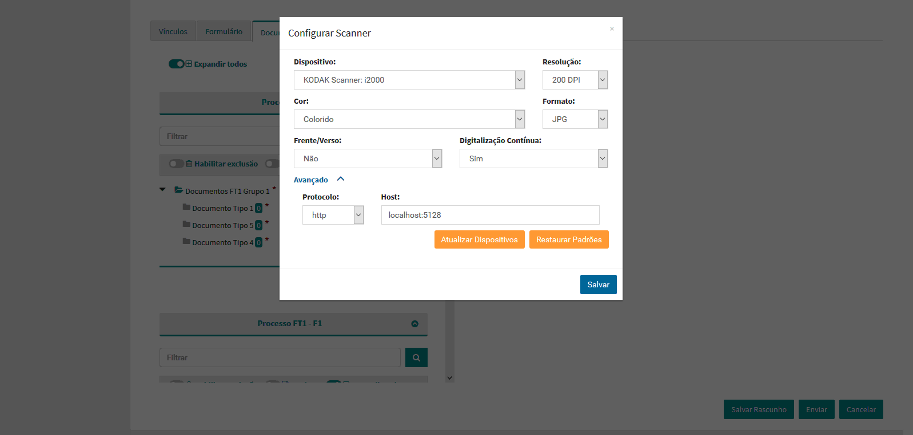

>>>>> + Dispositivo – apresenta a lista dos dispositivos (scanner) instalados/conectados na máquina, padrão carregado o primeiro da lista, caso não houver será apresentado “Selecione”;
>>>>> + Resolução – apresenta as opções: 200DPI, 300DPI, 400DPI, padrão carregado “200DPI”;
>>>>> + Cor – apresenta as opções: Colorido e Escala Cinza, padrão carregado “Colorido”;
>>>>> + Formato – apresenta as opções: JPG e PDF, padrão carregado “JPG”;
>>>>> + Frente/Verso – permite scannear documentos frente e verso quando a opção selecionada for “Sim”, padrão carregado “Não”;
>>>>> + Digitalização Continua – opção que permite puxar múltiplas páginas e digitalizar, padrão carregado “Não”.

**Avançado**

>>>>> + Protocolo – apresenta as opções para seleção do protocolo de comunicação: HTTP e HTTPS 
>>>>> + Host – campo para inclusão da porta, apresentado com a máscara: localhost:porta

>>>> - realiza atualização da lista de dispositivos conforme as novas configurações informadas.

Qualquer impossibilidade de realizar atualização o sistema apresenta uma mensagem alerta para o usuário.

A lista obtida com sucesso as novas configurações são salvas no Local Storage.

>>>>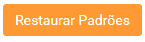 - desconsidera as configurações alteradas e retorna para configuração padrão, subscrevendo as configurações salvas no Local Storage.

### Classificação documento

>>>>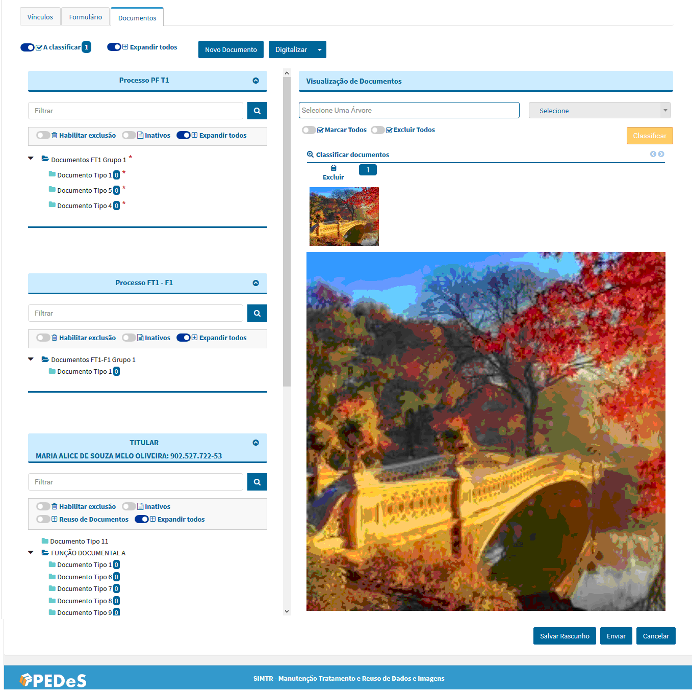

>>>>> + 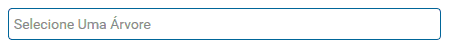 - carrega todos os vínculos (pessoa, garantia e produto) apresentados no dossiê produto para seleção.

>>>>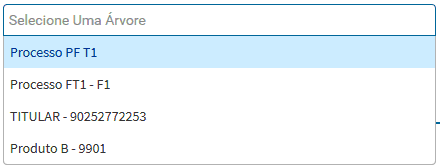

Após selecionado a árvore (vínculo) a combo de tipos documentos é carregada com os tipos parametrizados para o vínculo selecionado, processo e fase:

>>>>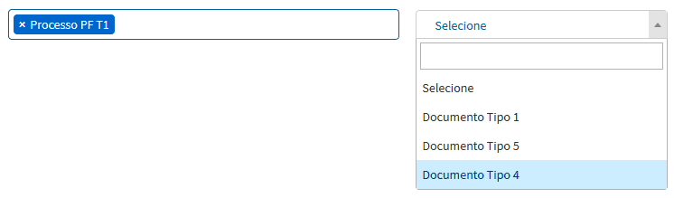

>>>>> +  -  permite selecionar todas as imagens para uma mesma classificação;

>>>>> +  - permite realizar exclusão da(s) imagem(ns) apresentada(s) para classificação, após acionada a opção o sistema apresenta uma mensagem de confirmação da operação;

>>>>> + 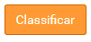 - opção habilitada após selecionada a árvore e o tipo de documento para classificação.

Realizada a classificação, o sistema apresenta o documento classificado na árvore correspondente, o padrão de nomenclatura do documento classificado é o seguinte: **data – hora – matrícula responsável – quantidade de imagem classificada**.

>>>>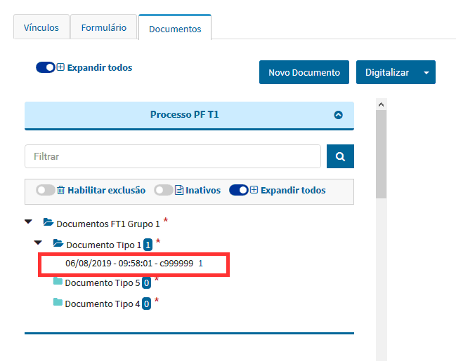

### Consulta documento

A consulta do documento classificado apresenta as seguintes opções:

>>>>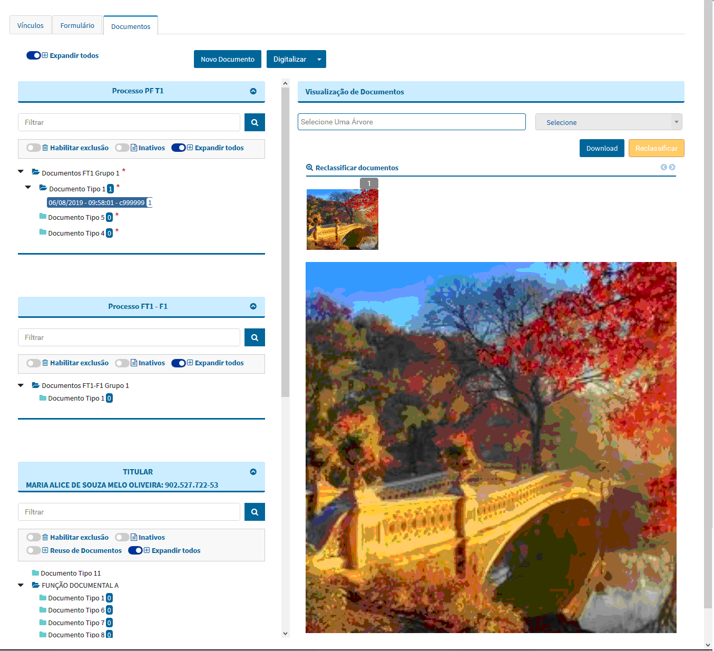

>>>>> + 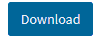 - permite realizar o download do documento consultado no formato PDF, ao acionar opção o sistema realizar procedimento padrão do Windows para esse tipo de ação:

>>>>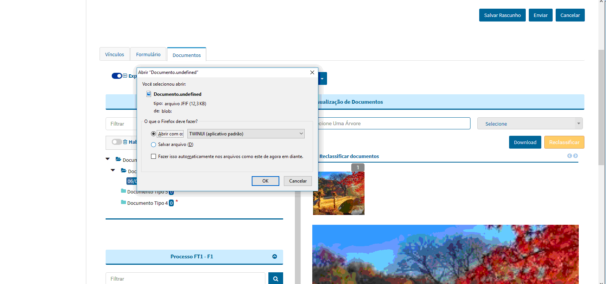

>>>>> + 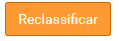 - opção habilitada quando selecionada uma árvore e o tipo documento para reclassificação. No exemplo abaixo o sistema remove o documento do Tipo 1 e reclassifica para o Tipo 5.

Nesse exemplo a reclassificação foi realizada na mesma árvore documental, mas pode ser realizada para árvore documental diferente do dossiê produto.

>>>>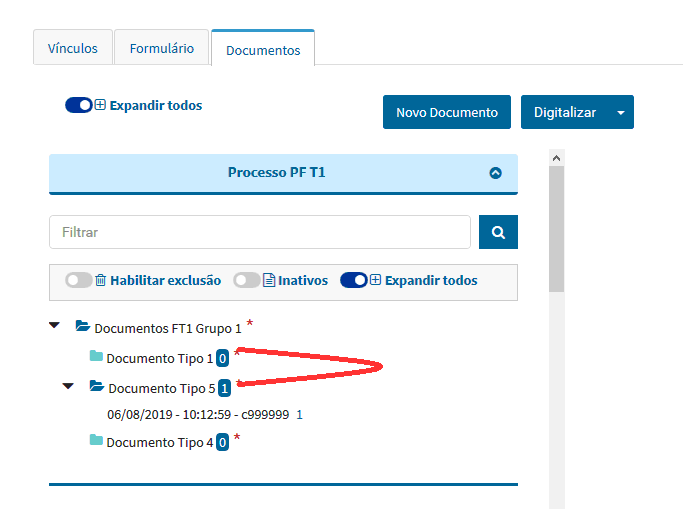

### Opções de manipulação da árvore de documentos

>>>>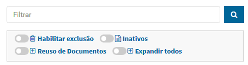

>>>>> + Filtrar – permite realizar uma consulta rápida na árvore de documentos, conforme o parâmetro informado e clicado no ícone referente à pesquisa o sistema refina os registros da árvore.

>>>>> + Habilita exclusão – quando acionado (com um clique) habilita a exclusão para os documentos que ainda não foram submetidos (salvos) no dossiê produto, documentos salvos no dossiê produto não são passíveis de exclusão.

>>>>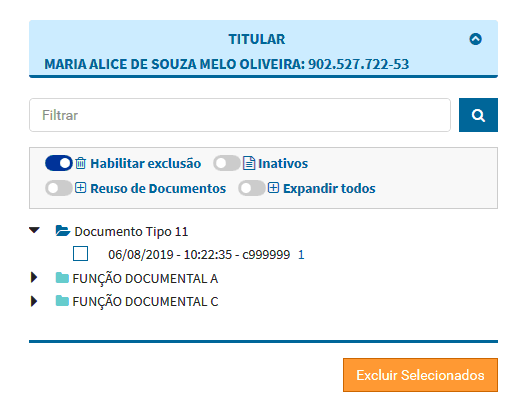

>>>>> + Inativos – quando acionado (com um clique) apresenta os documentos submetidos (salvos) no dossiê produto cuja data de validade do documento é menor que a data atual. A consulta padrão é apresentar apenas os documentos ativos do dossiê produto.

>>>>> + Expandir todos – quando acionado (com um clique) apresenta os documentos ativos submetidos e/ou classificados no dossiê produto. Apresentação padrão da árvore de documentos é apresentar até o nível da função documental, a opção permite expandir os documentos submetidos e/ou classificados.

>>>>> + Reuso de documentos – quando acionado (com um clique) apresenta os documentos que foram submetidos no dossiê cliente e que estão vigentes para reuso no dossiê produto, essa opção é apresentada apenas para a(s) árvore(s) documental(is) de vínculo de pessoas.

>>>>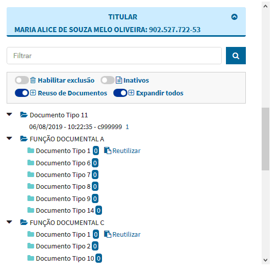

# Histórico

Essa aba é apresentada após acionado a opção **Salvar Rascunho** ou **Enviar**.

Essa aba apresenta todas as movimentações do ciclo de vida do dossiê produto.

As seguintes informações são apresentadas:

>>>>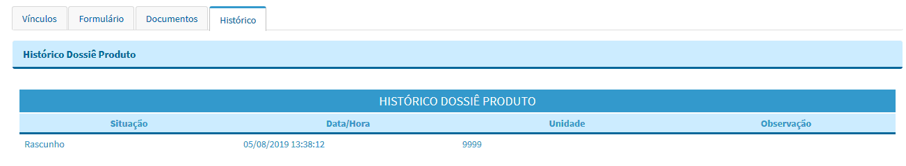

# Verificações

Essa aba é apresentada após tratamento do dossiê produto pela área de conformidade.

Essa aba apresenta o resultado das verificações realizadas no dossiê produto.

 O sistema possibilita a consulta do resultado de todas as fases do dossiê ou por fase:
 
 >>>>
 
 As seguintes informações são apresentadas:
 
  >>>>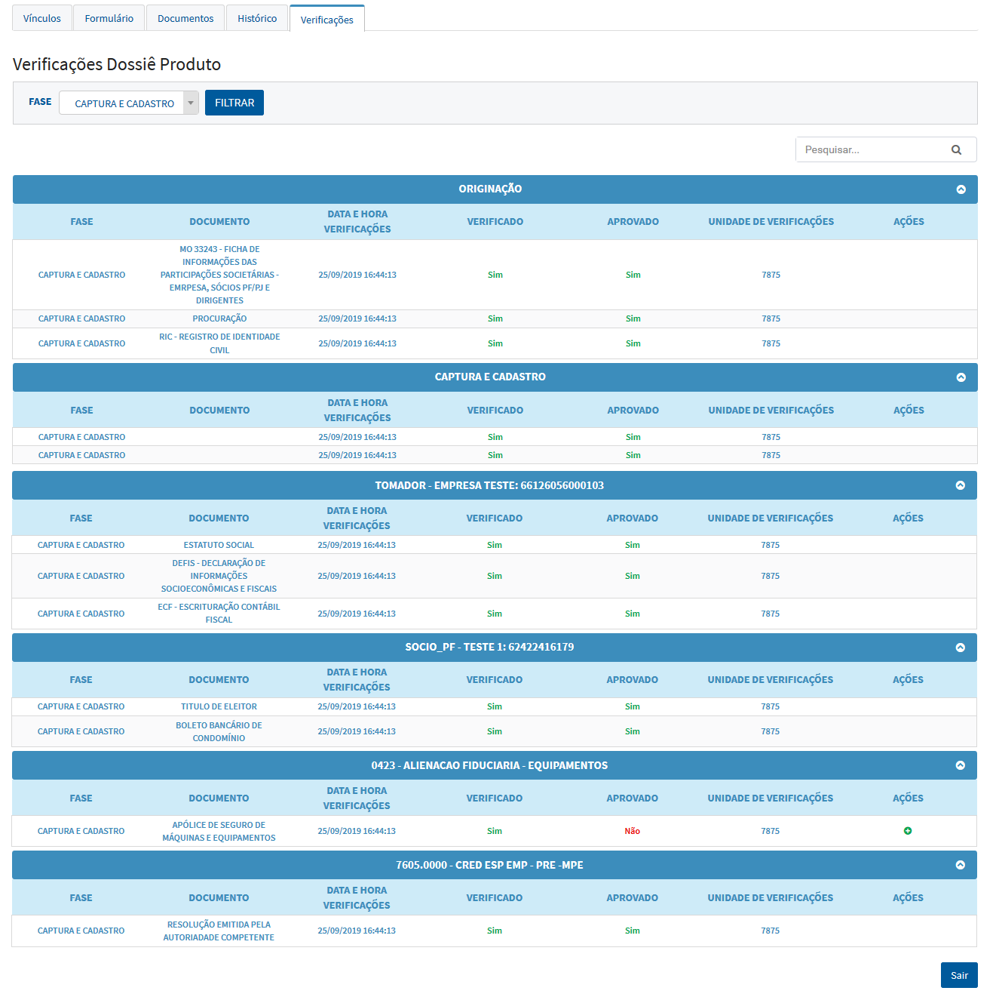
  
>>>>> +  **Fase** – apresenta a fase do processo que a verificação foi realizada;
>>>>> +  **Documento** – apresenta o nome do documento verificado no processo/fase,  para histórico de verificação da fase a informação do documento fica vazia;
>>>>> +  **Data e hora verificação** – apresenta a data e hora que a verificação do dossiê produto foi concluída;
>>>>> +  **Verificado** – indicativo se o checklist do documento foi verificado, documentos que não são obrigatório para fase sua a verificação no tratamento é opcional;
>>>>> +  **Aprovado** – indicativo da situação da verificação do documento;
>>>>> +  **Unidade de verificação** – apresenta a unidade responsável por realizar a verificação do dossiê produto;
>>>>> +  **Ações** - apresenta a opção para visualizar o(s) comentário(s) informado(s) pela área responsável pela verificação, caso preenchido, porque os comentários na verificação não são obrigatórios:

>>>>>> - quando acionado o sistema apresenta os comentários preenchidos durante a verificação da fase ou documento:
  
>>>>
 

