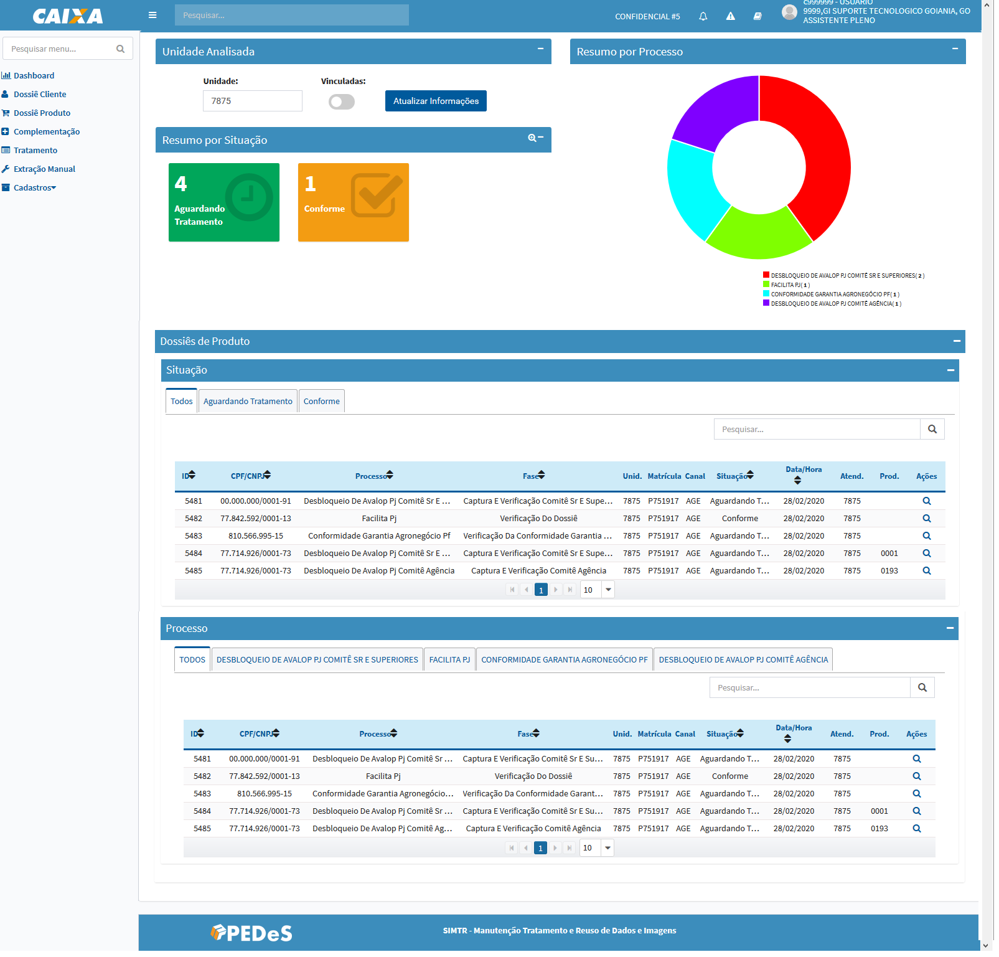
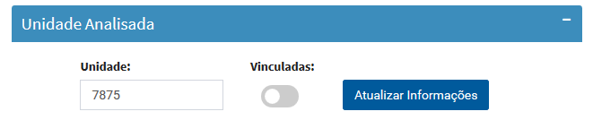
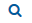

# Dashboard

>> A tela apresenta consulta de dossiês produtos agrupados pela: **Situação** e **Processo** registrados para unidade do usuário autenticado.

>> Conforme seleção da situação ou processo o sistema aplica o filtro na lista respectiva.

>> Para perfil especifico é possível consultar dossiês produtos de outras unidades pela funcionalidade **Unidade Analisada**:

>> Conforme a situação do dossiê produto são apresentadas as opções:

>>>>> +  - direciona para o formulário Manutenção Dossiê Produto para consulta das informações, nenhuma manipulação dos dados é permitida;

>>>>> +  - direciona para o formulário Manutenção Dossiê Produto para manipulação dos dados necessários.

