# Dossiê Cliente

>> + ##**Aba Identificação ** 

>>>>Para cadastrar um dossiê cliente é necessário informar o CPF/CNPJ e clica na opção  
	
>>>>O sistema apresenta as informações do cliente recuperadas do SICPF e SIISO, bloqueadas para alteração.

>> 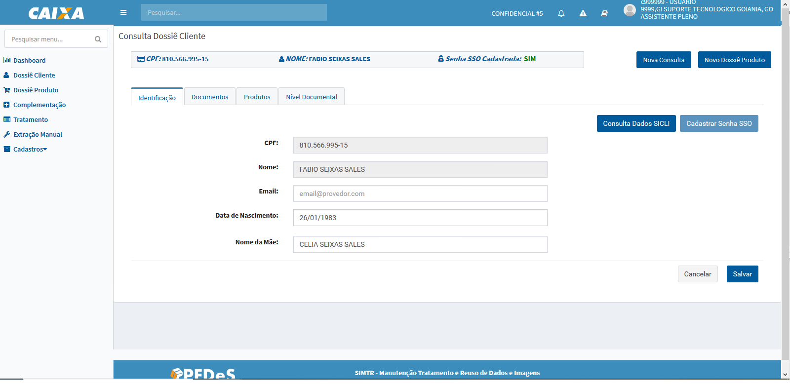

>>>>>> +  - permite realizar uma nova consulta de dossiê cliente, seja pessoa Física ou Jurídica. Ao acionar a opção o sistema descarta todas as informações apresentadas e apresenta o formulário no estado inicial.

>>>>>> +  - apresenta o modal para seleção dos processos para manutenção de um novo dossiê produto. 

>>>>>>  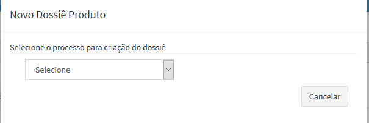

>>>>>> Habilitação de seleção de nível de processo dependerá da parametrização realizada para o processo selecionado.

>>>>>> 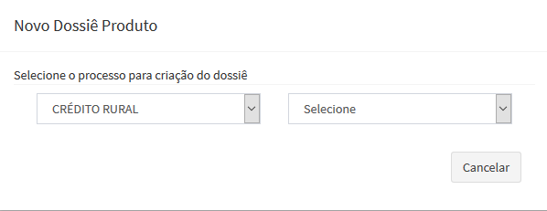

>>>>>> Caso já exista um dossiê produto cadastrado para o(s) processo(s) selecionado o sistema apresenta uma modal com a relação dos dossiês:

>>>>>> 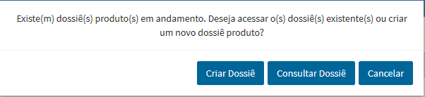

>>>>>>>  - direciona para formulário de manutenção dossiê produto para cadastro de um novo dossiê produto;

>>>>>>> 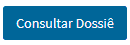 - apresenta a lista de dossiês produtos cadastros para o(s) processo(s) informado para seleção.

>>>>>>> 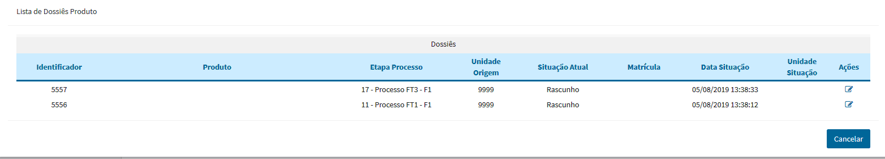

>>>>>> + 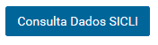 - realiza consulta no SICLI (Sistema de Clientes) para o CPF em questão e apresenta as seguintes informações do cliente agrupadas. 

>>>>>> + 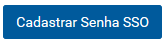 - apresenta a modal para cadastrar ou atualizar a senha do SSO para os clientes Pessoa Física

>>>>>> 

>> + ##**Aba Documentos ** 

>> 

>>>> Para submissão de documentos pessoais ao dossiê cliente são apresentadas três opções: Upload, Digitalizar,  e declaração de dados (Dados Declarados). Onde:

>>>>>> +  – permite realizar upload de uma imagem da máquina para classificação. Quando acionado o sistema apresenta a tela padrão do Windows para esse tipo de ação:

>>>>>> 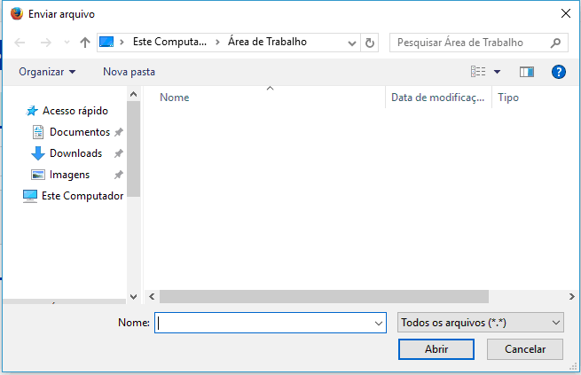

>>>>>> +  – apresenta um formulário com os campos conforme o tipo de identificador do cliente para preenchimento, após salvar os dados gera-se uma minuta com os dados informados.

>>>>>> +  – apresenta o formulário para configuração da digitalização do SCANNER local, as configurações preenchidas são salvas no Local Storage. Ao acionar a opção a seguinte tela é apresentada:

>>>>>> 

>>>>>>> + **Dispositivo** – apresenta a lista dos dispositivos (scanner) instalados/conectados na máquina, padrão carregado o primeiro da lista, caso não houver será apresentado “Selecione”;

>>>>>>> + **Resolução** – apresenta as opções: 200DPI, 300DPI, 400DPI, padrão carregado “200DPI”;

>>>>>>> + **Cor** – apresenta as opções: Colorido e Escala Cinza, padrão carregado “Colorido”;

>>>>>>> + **Formato** – apresenta as opções: JPG e PDF, padrão carregado “JPG”;

>>>>>>> + **Frente/Verso** – permite scannear documentos frente e verso quando a opção selecionada for “Sim”, padrão carregado “Não”;

>>>>>>> + **Digitalização Continua** – opção que permite puxar múltiplas páginas e digitalizar, padrão carregado “Não”.

>>> **Avançado**

>>>>>>> + Protocolo – apresenta as opções para seleção do protocolo de comunicação: HTTP e HTTPS 

>>>>>>> + Host – campo para inclusão da porta, apresentado com a máscara: localhost:porta

>>>>>> +  - realiza atualização da lista de dispositivos conforme as novas configurações informadas. 

>>>>>> Qualquer impossibilidade de realizar atualização o sistema apresenta uma mensagem alerta para o usuário.

>>>>>> A lista obtida com sucesso as novas configurações são salvas no Local Storage.

>>>>>> +  - desconsidera as configurações alteradas e retorna para configuração padrão, subscrevendo as configurações salvas no Local Storage.

>> **Ávore de documentos**

>>>>>> 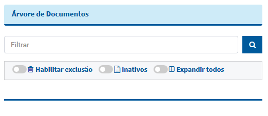

>>>>>>> +  **Filtrar** – permite realizar uma consulta rápida na árvore de documentos, conforme o parâmetro informado e clicado no ícone referente à pesquisa o sistema refina os registros da árvore.

>>>>>>> +  **Habilita exclusão** – quando acionado (com um clique) habilita a exclusão para os documentos que ainda não foram submetidos (salvos) no dossiê cliente, documentos salvos no dossiê cliente não são passíveis de exclusão.

>>>>>> 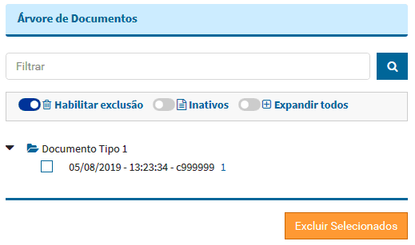

>>>>>>> +  **Inativos** – quando acionado (com um clique) apresenta os documentos submetidos (salvos) no dossiê cliente cuja data de validade do documento é menor que a data atual. A consulta padrão é apresentar apenas os documentos ativos do dossiê cliente.
 
 >>>>>> 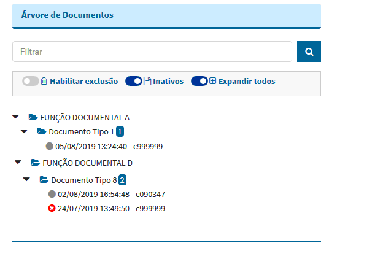
 
>>>>>>> + Expandir todos – quando acionado (com um clique) apresenta os documentos ativos submetidos no dossiê cliente. Apresentação padrão da árvore de documentos é apresentar até o nível da função documental, a opção permite expandir os documentos submetidos (salvos).
 
>> **Classificação documento**

>>>>>> 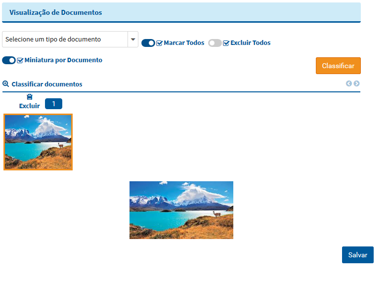

>>>>>> O sistema lista os tipos documentos definidos para o tipo cliente em questão ainda não classificados

>>>>>> +  - realiza a ação, realizada a classificação, o sistema apresenta o documento classificado na árvore de documentos 

>>>>>> +  - permite selecionar todas as imagens para uma mesma classificação;

>>>>>> +  - permite realizar exclusão da(s) imagem(ns) apresentada(s) para classificação, após acionada a opção o sistema apresenta uma mensagem de confirmação da operação;

>>>>>> +  - quando ativo permite apresentar um documento pdf com multipáginas numa única representação, quando na modal de consulta apresenta as demais páginas para visuallização, quando desabilitado quebra as páginas do pdf em várias imagens para visualização.

>> ## **Aba Produtos ** 
 
>>>>Apresenta a lista de processos cadastrados/contratados pelo cliente, permitindo a consulta e/ou edição (complementação) dos mesmos.

>>>>A consulta do dossiê produto, dependendo da situação é possível complementar os dados pela opção Manipular, o sistema permite realizar a edição.

>>>>>> 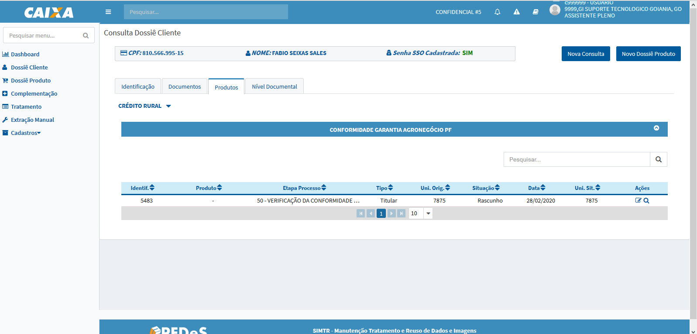 

>>>>>> +  - filtar os registros da lista considerando a informação preenchida;

>>>>>> +  - direciona para formulário de manutenção do dossiê produto em questão, permite apenas consultar das informações, nenhuma manipulação dos dados é permitida;  

>>>>>> +  - direciona para formulário de manutenção do dossiê produto em questão, permitindo a alteração das informações;

>>>>>> +  - direciona para o formulário para realização do tratamento, opção apresentada para dossiê produto na situação "Aguardando Tratamento" perfil ADMIN.

>> ## **Nível Documental ** 

>>>>Apresenta a lista de produtos aptos para contratação pelo cliente, considerando a documentação vigente.  

>>>>>>  

>>>>>> 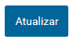 opção que realiza apuração do nível documental do cliente (conceito Dossiê Digital) que consiste em apresentar uma lista de produtos habilitados para inicio da contratação dentro da esteira de conformidade preventiva, considerando a documentação existente e vigente no dossiê do cliente.

>>>>>> + **Produtos com Documentação Válida** – apresenta a lista de produto cuja documentação do dossiê cliente (vigentes) são válidos para iniciar a contratação;

>>>>>> + **Consulta produto** – apresenta a lista de produtos com pendências documentais para iniciar contratação;

>>>>>> + **Função Documental x Tipo Documento** – apresenta as parametrizações de função x tipo documento configurados para o tipo do cliente. 

