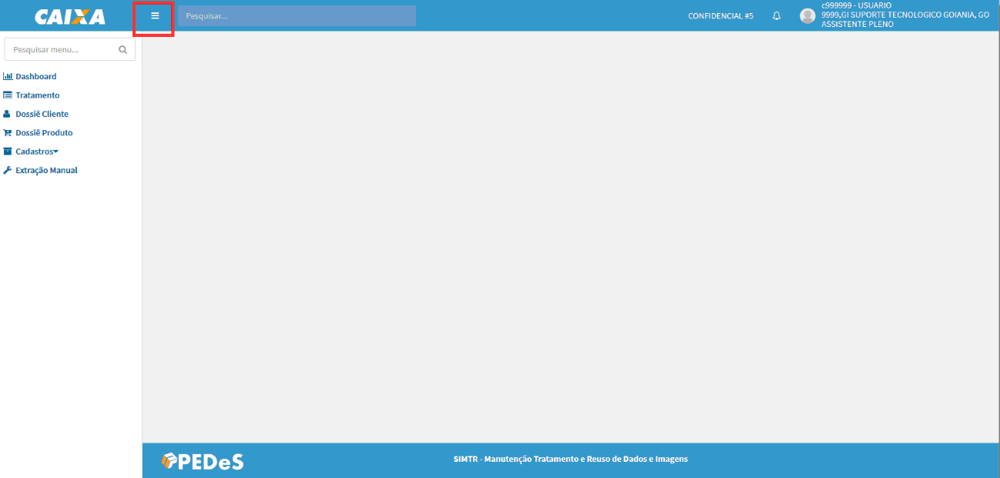
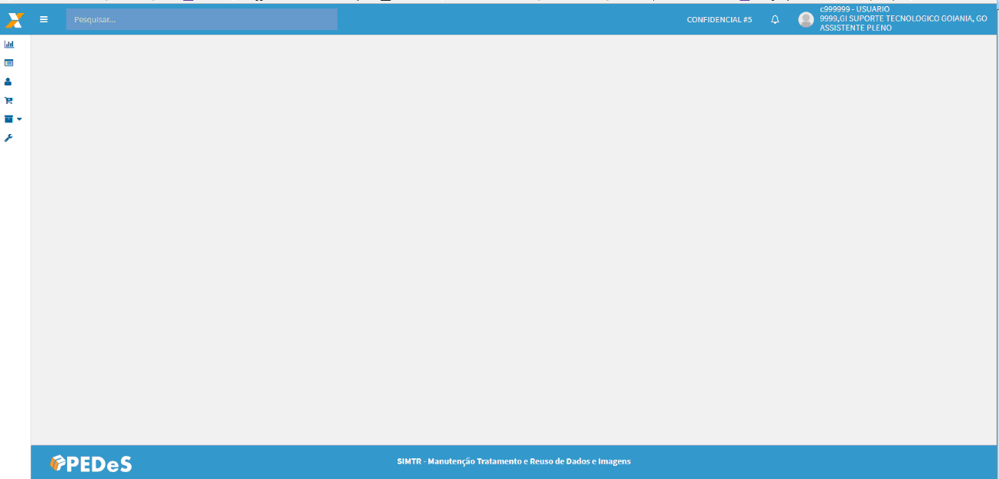
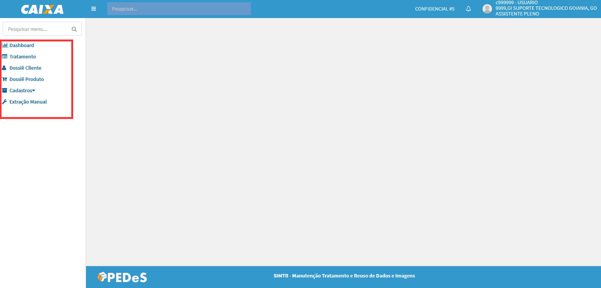
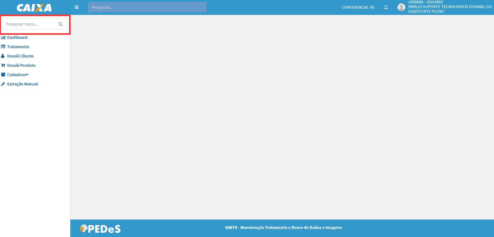
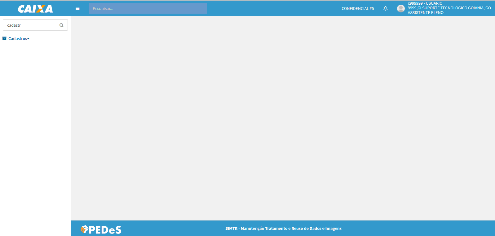
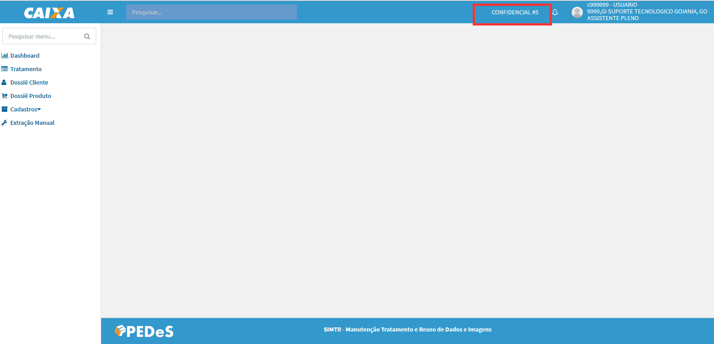
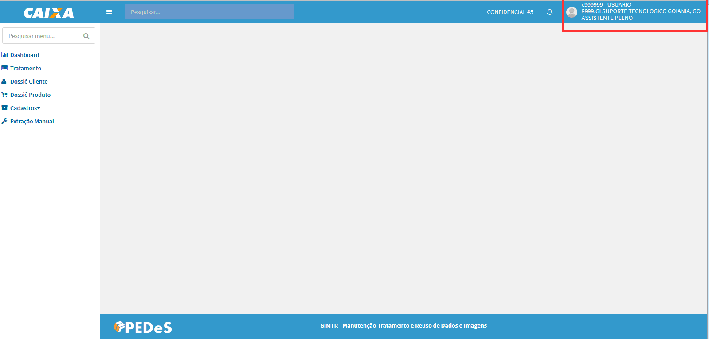
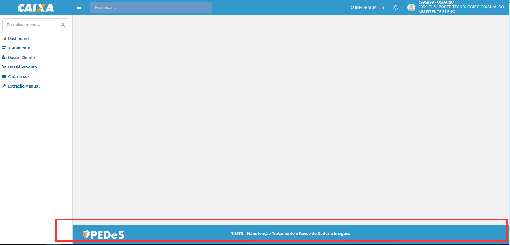

# Estrutura do sistema - opções

>> + **Recolher Menu Lateral ** - essa opção permite recolher apresentação do menu na lateral, aumentando o campo de visualização dos formulários.

 >> 
 
 >>>Após acionada a opção, a representação do menu passa a ser por ícones.
 
 >>>> 

 
>> + **Menu Lateral ** - permite o acesso as funcionalidades do sistema, respeitando as regras de permissões de acesso.
  >>>> 
  
>> + **Pesquisa rápida menu ** - essa opção permite realizar consulta rápida entre as funcionalidades.
  >>>> 
 
  >>>> 
  
>> + **Código de confidencialidade do sistema ** - apresentação do código de confidencialidade do sistema.
  >>>> 
 

>> + **Dados do usuário autenticado ** - apresentação dos dados do usuário autenticado: Matrícula, Nome, Código, Descrição e Unidade Federativa da unidade de lotação e o Cargo de ocupação do usuário.
  >>>> 
 
 
>> + **Rodapé ** 
>>> + Apresenta a sigla da área responsável pelo desenvolvimento do sistema
>>> + Apresenta a descrição da sigla do sistema
>>> + Apresentar a versão do sistema

  >>>> 